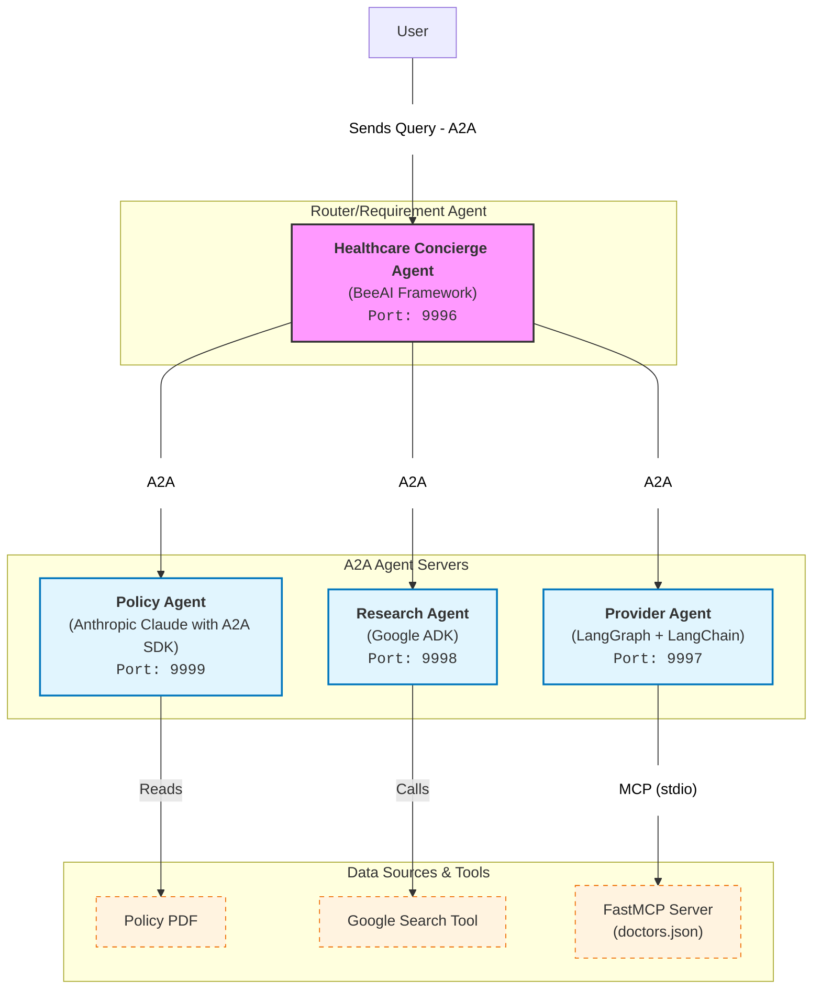

# Lesson 10 - Creating an Agentic multi-agent system using A2A with BeeAI Framework

In this final code lesson, you will create a comprehensive "Healthcare Concierge" system. You will use the **BeeAI Framework** to orchestrate all three agents you have built so far (Policy, Research, and Provider). The BeeAI `RequirementAgent` will act as a router, deciding which A2A agent to hand off to based on the user's complex query.




```python
import asyncio
import os
from typing import Any

import nest_asyncio
from IPython.display import Markdown, display
from dotenv import load_dotenv

from helpers import authenticate

nest_asyncio.apply()
```

## 10.1. Start All Agent Servers

First, ensure that your Policy Agent is running:
- Open Terminal 1 by running the cell below.
- If the agent is still running from the previous lesson, you don't need to do anything.
- If the agent has stopped, type: `uv run a2a_policy_agent.py` (you don't need to go back to the previous lesson).


```python
from IPython.display import IFrame

url = os.environ.get("DLAI_LOCAL_URL").format(port=8888)
# Terminal 1: uv run a2a_policy_agent.py
IFrame(f"{url}terminals/1", width=550, height=200)
```

Second, ensure that your Research Agent is running:
- Open Terminal 2 by running the cell below.
- If the agent is still running from the previous lesson, you don't need to do anything.
- If the agent has stopped, type: `uv run a2a_research_agent.py` (you don't need to go back to the previous lesson).


```python
# Terminal 2: uv run a2a_research_agent.py
IFrame(f"{url}terminals/2", width=550, height=200)
```

Third, ensure that your Provider Agent is running:
- Open Terminal 3 by running the cell below.
- If the agent is still running from the previous lesson, you don't need to do anything.
- If the agent has stopped, type: `uv run a2a_provider_agent.py` (you don't need to go back to the previous lesson).


```python
# Terminal 3: uv run a2a_provider_agent.py
IFrame(f"{url}terminals/3", width=550, height=200)
```

## 10.2. Define BeeAI Components

Here you will:
1.  Import BeeAI framework components, including `RequirementAgent` and `HandoffTool`.
2.  Define `A2AAgent` instances for each of your running servers.
3.  Use `check_agent_exists()` to fetch the metadata (AgentCard) from each server.


```python
from beeai_framework.adapters.a2a.agents import A2AAgent
from beeai_framework.adapters.vertexai import VertexAIChatModel
from beeai_framework.agents.requirement import RequirementAgent
from beeai_framework.agents.requirement.requirements.conditional import (
    ConditionalRequirement,
)
from beeai_framework.memory import UnconstrainedMemory
from beeai_framework.memory.unconstrained_memory import UnconstrainedMemory
from beeai_framework.middleware.trajectory import EventMeta, GlobalTrajectoryMiddleware
from beeai_framework.tools import Tool
from beeai_framework.tools.handoff import HandoffTool
from beeai_framework.tools.think import ThinkTool


class ConciseGlobalTrajectoryMiddleware(GlobalTrajectoryMiddleware):
    def _format_prefix(self, meta: EventMeta) -> str:
        prefix = super()._format_prefix(meta)
        return prefix.rstrip(": ")

    def _format_payload(self, value: Any) -> str:
        return ""
```


```python
load_dotenv()
_, project_id = authenticate()
```


```python
host = os.environ.get("AGENT_HOST")
policy_agent_port = os.environ.get("POLICY_AGENT_PORT")
research_agent_port = os.environ.get("RESEARCH_AGENT_PORT")
provider_agent_port = os.environ.get("PROVIDER_AGENT_PORT")
healthcare_agent_port = int(os.environ.get("HEALTHCARE_AGENT_PORT"))
```


```python
policy_agent = A2AAgent(
    url=f"http://{host}:{policy_agent_port}", 
    memory=UnconstrainedMemory()
)
# Run `check_agent_exists()` to fetch and populate AgentCard
asyncio.run(policy_agent.check_agent_exists())
print("\tℹ️", f"{policy_agent.name} initialized")
```


```python
research_agent = A2AAgent(
    url=f"http://{host}:{research_agent_port}", 
    memory=UnconstrainedMemory()
)
asyncio.run(research_agent.check_agent_exists())
print("\tℹ️", f"{research_agent.name} initialized")
```


```python
provider_agent = A2AAgent(
    url=f"http://{host}:{provider_agent_port}", 
    memory=UnconstrainedMemory()
)
asyncio.run(provider_agent.check_agent_exists())
print("\tℹ️", f"{provider_agent.name} initialized")
```

## 10.3. Configure the Orchestrator (Healthcare Concierge)

You will now configure the `RequirementAgent`. This agent uses a `VertexAIChatModel` and is equipped with `HandoffTool`s connected to your A2A agents. The instructions explicitly guide the LLM on how to use each specific agent (Research for conditions, Policy for insurance, Provider for doctors) to answer multi-part questions.


```python
healthcare_agent = RequirementAgent(
    name="Healthcare Agent",
    description="""A personal concierge for Healthcare Information, 
    customized to your policy.""",
    llm=VertexAIChatModel(
        model_id="gemini-2.5-flash",
        project=project_id,
        location="global",
        allow_parallel_tool_calls=True,
        allow_prompt_caching=False,
        settings={
            "api_base": f"{os.getenv('GOOGLE_VERTEX_BASE_URL')}",
            "use_psc_endpoint_format": True,
        }
    ),
    tools=[
        thinktool := ThinkTool(),
        policy_tool := HandoffTool(
            target=policy_agent,
            name=policy_agent.name,
            description=policy_agent.agent_card.description,
        ),
        research_tool := HandoffTool(
            target=research_agent,
            name=research_agent.name,
            description=research_agent.agent_card.description,
        ),
        provider_tool := HandoffTool(
            target=provider_agent,
            name=provider_agent.name,
            description=provider_agent.agent_card.description,
        ),
    ],
    requirements=[
        # ConditionalRequirement(policy_tool, consecutive_allowed=False),
        ConditionalRequirement(
            thinktool, force_at_step=1, force_after=Tool, 
            consecutive_allowed=False
        ),
    ],
    role="Healthcare Concierge",
    instructions=(
        f"""You are a concierge for healthcare services. Your task is 
        to handoff to one or more agents to answer questions and provide 
        a detailed summary of their answers. Be sure that all of their 
        questions are answered before responding.
        Use `{policy_agent.name}` to answer insurance-related questions.
        
        IMPORTANT: When returning answers about providers, only output 
        providers from `{provider_agent.name}` and only provide insurance 
        information based on the results from `{policy_agent.name}`.

        In your output, put which agent gave you the information!"""
    ),
)

print("\tℹ️", f"{healthcare_agent.meta.name} initialized")
```

## 10.4. Run the Full Workflow

Test the system with a complex query that requires information from all three sub-agents.


```python
response = await healthcare_agent.run(
    """I'm based in Austin, TX. How do I get mental health therapy near me 
    and what does my insurance cover?"""
).middleware(ConciseGlobalTrajectoryMiddleware())
display(Markdown(response.last_message.text))
```

## 10.5. Write the Agent Code to a File

Write the Concierge agent code to a Python file to be able to run it as an A2A Agent.


```python
%%writefile ../a2a_healthcare_agent.py
from dotenv import load_dotenv
from helpers import authenticate
from typing import Any
import asyncio
import os
from beeai_framework.adapters.a2a.serve.server import A2AServer, A2AServerConfig
from beeai_framework.adapters.a2a.agents import A2AAgent
from beeai_framework.adapters.vertexai import VertexAIChatModel
from beeai_framework.agents.requirement import RequirementAgent
from beeai_framework.agents.requirement.requirements.conditional import ConditionalRequirement
from beeai_framework.memory import UnconstrainedMemory
from beeai_framework.memory.unconstrained_memory import UnconstrainedMemory
from beeai_framework.middleware.trajectory import EventMeta, GlobalTrajectoryMiddleware
from beeai_framework.serve.utils import LRUMemoryManager
from beeai_framework.tools import Tool, tool
from beeai_framework.tools.handoff import HandoffTool
from beeai_framework.tools.think import ThinkTool

# Log only tool calls
class ConciseGlobalTrajectoryMiddleware(GlobalTrajectoryMiddleware):
    def _format_prefix(self, meta: EventMeta) -> str:
        prefix = super()._format_prefix(meta)
        return prefix.rstrip(": ")

    def _format_payload(self, value: Any) -> str:
        return ""

def main():
    print(f"Running A2A Orchestrator Agent")
    load_dotenv()
    _, project_id = authenticate()

    host = os.environ.get("AGENT_HOST")
    policy_agent_port = os.environ.get("POLICY_AGENT_PORT")
    research_agent_port = os.environ.get("RESEARCH_AGENT_PORT")
    provider_agent_port = os.environ.get("PROVIDER_AGENT_PORT")
    healthcare_agent_port = int(os.environ.get("HEALTHCARE_AGENT_PORT"))

    # Log only tool calls
    GlobalTrajectoryMiddleware(target=[Tool]) 

    policy_agent = A2AAgent(
        url=f"http://{host}:{policy_agent_port}", memory=UnconstrainedMemory()
    )
    # Run `check_agent_exists()` to fetch and populate AgentCard
    asyncio.run(policy_agent.check_agent_exists())
    print("\tℹ️", f"{policy_agent.name} initialized")
    
    research_agent = A2AAgent(
        url=f"http://{host}:{research_agent_port}", memory=UnconstrainedMemory()
    )
    asyncio.run(research_agent.check_agent_exists())
    print("\tℹ️", f"{research_agent.name} initialized")

    provider_agent = A2AAgent(
        url=f"http://{host}:{provider_agent_port}", memory=UnconstrainedMemory()
    )
    asyncio.run(provider_agent.check_agent_exists())
    print("\tℹ️", f"{provider_agent.name} initialized")

    healthcare_agent = RequirementAgent(
        name="Healthcare Agent",
        description="A personal concierge for Healthcare Information, customized to your policy.",
        llm=VertexAIChatModel(
            model_id="gemini-2.5-flash",
            project=project_id,
            location="global",
            allow_parallel_tool_calls=True,
            settings={
                "api_base": f"{os.getenv('GOOGLE_VERTEX_BASE_URL')}",
                "use_psc_endpoint_format": True,
            }
        ),
        tools=[
            thinktool:=ThinkTool(),
            policy_tool:=HandoffTool(
                target=policy_agent,
                name=policy_agent.name,
                description=policy_agent.agent_card.description,
            ),
            research_tool:=HandoffTool(
                target=research_agent,
                name=research_agent.name,
                description=research_agent.agent_card.description,
            ),
            provider_tool:=HandoffTool(
                target=provider_agent,
                name=provider_agent.name,
                description=provider_agent.agent_card.description,
            ),
        ],
        requirements=[
            ConditionalRequirement(policy_tool, consecutive_allowed=False),
            ConditionalRequirement(thinktool, force_at_step=1, force_after=Tool, consecutive_allowed=False),
        ],
        role="Healthcare Concierge",
        instructions=(
            f"""You are a concierge for healthcare services. Your task is to handoff to one or more agents to answer questions and provide a detailed summary of their answers. Be sure that all of their questions are answered before responding.
            Use `{policy_agent.name}` to answer insurance-related questions.
            
            IMPORTANT: When returning answers about providers, only output providers from `{provider_agent.name}` and only provide insurance information based on the results from `{policy_agent.name}`.
    
            In your output, put which agent gave you the information!"""
        ),
    )

    print("\tℹ️", f"{healthcare_agent.meta.name} initialized")
    
```

### Add the A2AServer registration
The only change to run an agent as an A2A agent is to add the single A2AServer registration statement.


```python
%%writefile ../a2a_healthcare_agent.py -a

    # Register the agent with the A2A server and run the HTTP server
    # we use LRU memory manager to keep limited amount of sessions in the memory
    A2AServer(
        config=A2AServerConfig(port=healthcare_agent_port, protocol="jsonrpc", host=host ),
        memory_manager=LRUMemoryManager(maxsize=100),
    ).register(healthcare_agent, send_trajectory=True).serve()

if __name__ == "__main__":
    main()   
```

## 10.6. Serve the Concierge Agent

Finally, you can register this high-level "Concierge" agent itself as an A2A server. This demonstrates the recursive power of A2A: an agent composed of other A2A agents can itself be exposed as an A2A agent.

Now to activate your configured A2A agent, you would need to run your agent server. You can run the agent server using `uv`:

- Open Terminal 4 by running the cell below
- Type `uv run a2a_healthcare_agent.py` to run the server and activate your A2A agent.


```python
import os

from IPython.display import IFrame

url = os.environ.get("DLAI_LOCAL_URL").format(port=8888)
IFrame(f"{url}terminals/4", width=550, height=600)
```

## 10.7. Run the Client

Question: I'm based in Austin, TX. How do I get mental health therapy near me and what does my insurance cover?


```python
agent = A2AAgent(url="http://127.0.0.1:9996", 
                 memory=UnconstrainedMemory())
response = await agent.run(
    "I'm based in Austin, TX. How do I get mental health therapy near me and what does my insurance cover?"
).middleware(ConciseGlobalTrajectoryMiddleware())
display(Markdown(response.last_message.text))
```

## 10.8. Resources

- [BeeAI Framework](https://framework.beeai.dev/introduction/welcome)
- [BeeAI Requirement Agent](https://framework.beeai.dev/modules/agents/requirement-agent)
- [BeeAI Framework GitHub](https://github.com/i-am-bee/beeai-framework)
- [Equivalent notebook in the course repo](https://github.com/holtskinner/A2AWalkthrough/blob/main/8_BeeAIRequirement.ipynb)

<div style="background-color:#fff6ff; padding:13px; border-width:3px; border-color:#efe6ef; border-style:solid; border-radius:6px">
<p> ⬇ &nbsp; <b>Download Notebooks:</b> 1) click on the <em>"File"</em> option on the top menu of the notebook and then 2) click on <em>"Download"</em>.</p>
</div>

